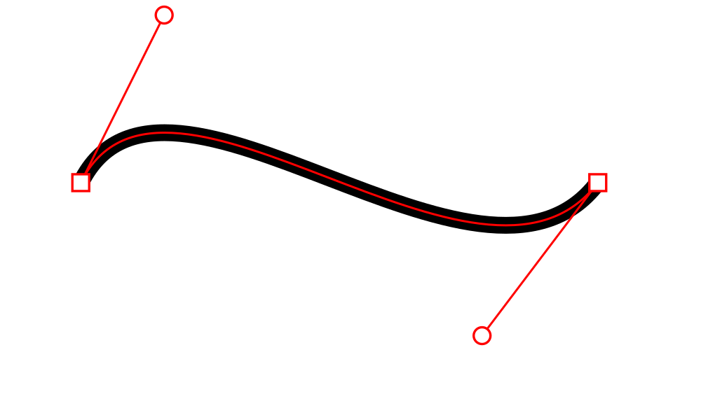
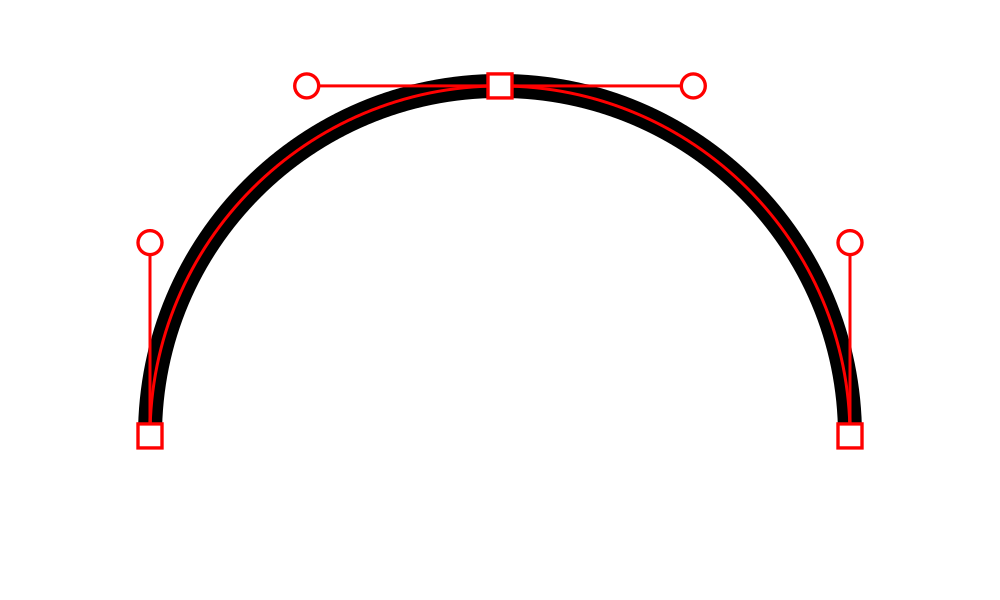
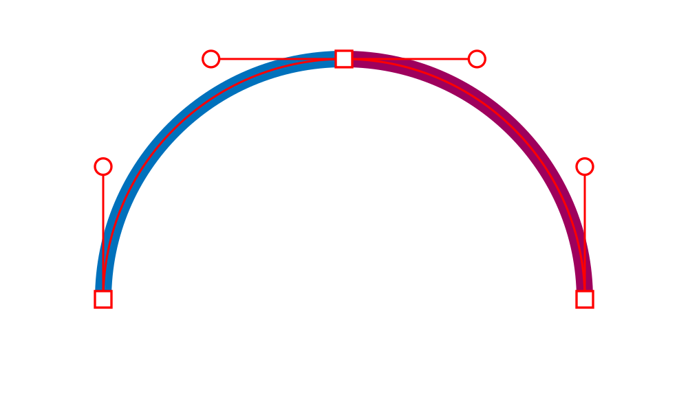
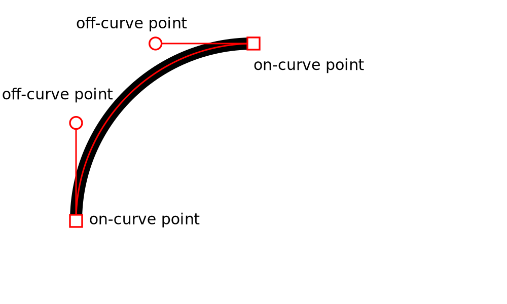

```fm
style: negative
background: true
```

## Hello _👋_

# {{process.content.frontmatter.title}}

<footer>

2022 · UX Exchange · Stefan Huber

</footer>
--s--

## Next 10 min

# Let's question the way we work with _vector curves_.

--s--

## Shape


--s--

## Go! Pixel! Go!


--s--

## Digital

<div class="box--w80p img--w100p img--pixelate">


</div>

--s--

```fm
style: negative
background: true
```

## Resolution independence

# Bézier spline

--s--

## How does it work?



--s--

## Linear curve

<div class="box--w60p img--w100p">


</div>

<footer>

Source: [Wikipedia · Bézier curve](https://en.wikipedia.org/wiki/B%C3%A9zier_curve)

</footer>

--s--

## Quadratic curve

<div class="box--w60p img--w100p">


</div>

<footer>

Source: [Wikipedia · Bézier curve](https://en.wikipedia.org/wiki/B%C3%A9zier_curve)

</footer>
--s--

## Cubic curve

<div class="box--w60p img--w100p">


</div>

<footer>

Source: [Wikipedia · Bézier curve](https://en.wikipedia.org/wiki/B%C3%A9zier_curve)

</footer>

--s--

## Higher-order curve

- [Example](https://ciechanow.ski/curves-and-surfaces/#cs_control_points)

<!--  { .box--w60p } -->

<!-- <footer>

Source: [Wikipedia · Bézier curve](https://en.wikipedia.org/wiki/B%C3%A9zier_curve)

</footer> -->

<!-- ## Higher-order curve <small>(4 off-curve pooints)</small> -->

<!--  { .box--w50p } -->

<!-- <footer>

Source: [Wikipedia · Bézier curve](https://en.wikipedia.org/wiki/B%C3%A9zier_curve)

</footer> -->

--s--

```fm
style: negative
background: true
```

## More problems

# Curvature

--s--

## Curvature

<div class="box--w80p img--w100p">


</div>

<footer>

[Source](https://ivomynttinen.com/blog/ios-design-guidelines)

</footer>

--s--

## Sketch


<footer>

[Source](https://forum.affinity.serif.com/index.php?/topic/55460-continuous-curvature-rounding-default/)

</footer>

--s--

## Bézier spline · Basics



--s--

## Bézier spline · Basics


--s--

## Bézier spline · Basics



--s--

## Curvature

- [Example rounded corner](https://ciechanow.ski/curves-and-surfaces/#cs_two_cubic_patches_side)
- [Example order of curvature](https://ciechanow.ski/curves-and-surfaces/#cs_continuities)

--s--

```fm
style: negative
background: true
```

## _💩_ oh nooo

# Bézier whut?

--s--

## So hard...

<video controls>
  <source src="img/bezier-by-marius.mp4" type="video/mp4" />
  Your browser does not support the video tag.
</video>

<footer>

Thank you Marius Küng for the Demo-Time

</footer>

--s--

```fm
style: negative
background: true
```

## Future

# And now what?

--s--

## Adobe

# What is Illustrator doing?

--s--

## Curvature Tool

<video controls>
  <source src="img/bezier-by-adobe.mp4" type="video/mp4" />
  Your browser does not support the video tag.
</video>

--s--

## Others

# Let's talk about Raph Levien

- Spiro
- [the new spline-thingy](https://spline.technology/demo/)

--s--

```fm
style: negative
background: true
```

## exit 0; thx

# Questions?
